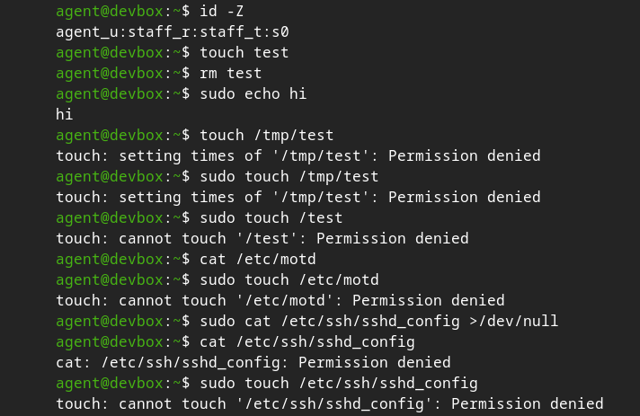

# agentic-selinux



## Mission

Provides a confined SELinux domain for AI agents.

By default, the agent has **broad read and inspection access** (including via sudo) while **all modifications will be blocked**. Specific capabilities can be enabled through booleans when required.

## Booleans

You can enable additional capabilities using booleans. All booleans are **off by default**.

### Available booleans

| Boolean                  | Default | Description                                           |
|--------------------------|---------|-------------------------------------------------------|
| `agent_manage_systemd`   | false   | Allow managing systemd units (start, stop, reload)    |

### Usage

```bash
# Enable persistently
sudo setsebool -P agent_manage_systemd on

# Check current value
getsebool agent_manage_systemd

# Disable
sudo setsebool -P agent_manage_systemd off
```

## Quick Start

### 1. Create the agent user

```bash
sudo useradd -m -s /bin/bash agent
sudo passwd agent
sudo usermod -aG wheel agent
```

### 2. Map the user to a confined SELinux identity

```bash
sudo semanage user -a -R "staff_r" -r s0-s0:c0.c1023 agent_u
sudo semanage login -a -s agent_u -r s0 agent
```

### 3. Allow sudo with the custom domain

```bash
echo 'agent ALL=(ALL) TYPE=agent_t ROLE=staff_r ALL' | sudo tee /etc/sudoers.d/agent
sudo chmod 440 /etc/sudoers.d/agent
```

### 4. Install the policy

```bash
cd fedora
sudo semodule -i agent.pp
```

## Working with the Policy

### Generate a new policy template

```bash
sepolicy generate --confined_admin -n agent
```

### Find and analyze denials

```bash
sudo ausearch -m avc -ts recent | audit2allow -R
sudo ausearch -m avc --start $(date +%H:%M -d '5 minutes ago') | audit2allow -R
```

### Rebuild and reload after editing

```bash
make -f /usr/share/selinux/devel/Makefile
sudo semodule -i agent.pp
```

## Notes

- This policy is currently developed and tested on **Fedora**. Contributions for other distributions (RHEL, Rocky Linux, AlmaLinux, Gentoo, etc.) are very welcome.
- Re-login as the `agent` user after changing SELinux mappings.
- The policy is intentionally **read-heavy** by default.

