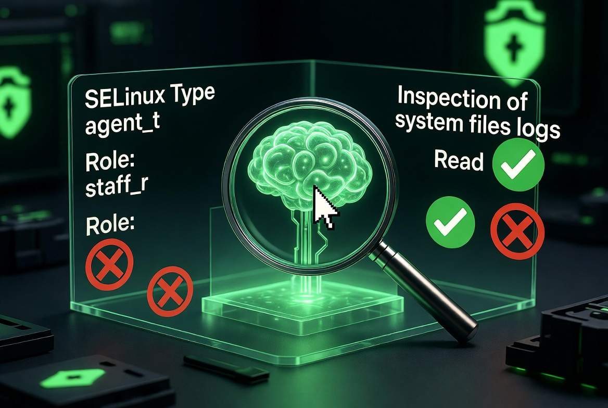

#+TITLE: agentic-selinux
#+OPTIONS: toc:nil

* Mission

Provides a confined SELinux domain for AI agents.

By default, the agent has **broad read and inspection access** (including via sudo) while **all modifications are blocked**. Specific capabilities can be enabled through booleans when required.

* Quick Start

**1. Create the agent user**
#+begin_src bash
sudo useradd -m -s /bin/bash agent
sudo passwd agent
sudo usermod -aG wheel agent
#+end_src

**2. Map the user to a confined SELinux identity**
#+begin_src bash
sudo semanage user -a -R "staff_r" -r s0-s0:c0.c1023 agent_u
sudo semanage login -a -s agent_u -r s0 agent
#+end_src

**3. Allow sudo with the custom domain**
#+begin_src bash
echo 'agent ALL=(ALL) TYPE=agent_t ROLE=staff_r ALL' | sudo tee /etc/sudoers.d/agent
sudo chmod 440 /etc/sudoers.d/agent
#+end_src

**4. Install the policy**
#+begin_src bash
cd fedora
sudo semodule -i agent.pp
#+end_src

* Booleans

You can enable additional capabilities using booleans. All booleans are **off by default**.

**Available booleans**

| Boolean                  | Default | Description                              |
|--------------------------+---------+------------------------------------------|
| ~agent_use_systemctl~    | false   | Allow running `systemctl` and interacting with systemd |

**Usage**

#+begin_src bash
# Enable persistently
sudo setsebool -P agent_use_systemctl on

# Check current value
getsebool agent_use_systemctl

# Disable
sudo setsebool -P agent_use_systemctl off
#+end_src

**Adding new booleans**

Edit `fedora/agent.te`, define a new boolean with `gen_bool()`, wrap the rules inside `tunable_policy()`, then rebuild and reload:

#+begin_src bash
make -f /usr/share/selinux/devel/Makefile
sudo semodule -i agent.pp
#+end_src

* Working with the Policy

**Generate a new policy template**
#+begin_src bash
sepolicy generate --confined_admin -n agent
#+end_src

**Find and analyze denials**
#+begin_src bash
sudo ausearch -m avc -ts recent | audit2allow -R
sudo ausearch -m avc --start $(date +%H:%M -d '5 minutes ago') | audit2allow -R
#+end_src

**Rebuild and reload after editing**
#+begin_src bash
make -f /usr/share/selinux/devel/Makefile
sudo semodule -i agent.pp
#+end_src

* Notes
- Always test in **permissive** mode first (`setenforce 0`).
- Re-login as the `agent` user after changing SELinux mappings.
- The policy is intentionally **read-heavy** by default.
